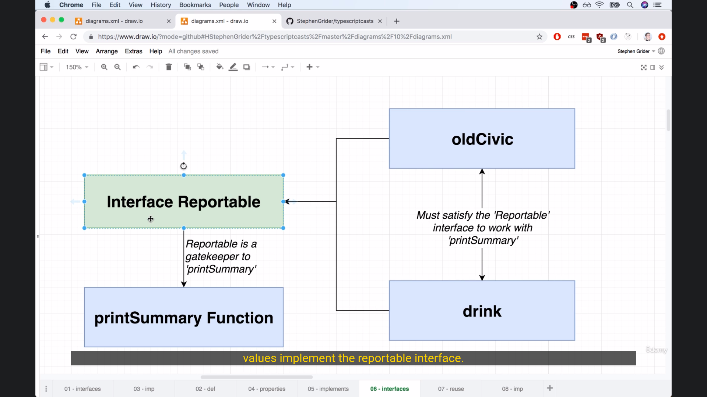

# Interface

Creates a **new type**, describing the property names and value types of an object

> Interfaces + Classes = really strong code reuse in TS

We can think of that interface that using as argument to that function as being like a gatekeeper of sorts
If we have any value want to work with this `printSummary` function, we have to make sure these value implement the reportable interface, If they don't, they cannot be used with `printSummary`, using Interface Reportable as a gatekeeping we will get some amount of code reuse in TS
